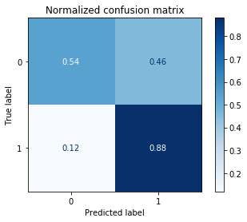

# Santander Bank Targeted Advertisement

## Summary

We wanted to create a proudct for Santander Bank which would increase their marketing efficiency. Santander Bank offer variety of products and has collected millions of data from old customers. We get our dataset from [Santander Bank's Kaggle challenge](https://www.kaggle.com/c/santander-product-recommendation) . Our goal was to train a model which would recommend current account to upcoming customers.

## Notebooks

1. santander_preprocess.ipnby is used for cleaning the dataset and preprocessing
2. EDA.ipnby is our notebook where we explore the dataset categorize try to extract meaning from visualization and informations.
3. Model.ipnby notebook is our notebook where we run different models to find the best predictor models

## Data Understanding

Our dataset is from Santander bank over 1.5 year of customer transactions starts at 2015-01-28 and the columns after ind_(xyz)_ult1 #25 is what customers buy and we will predict what will they buy after May 2016 for our test dataset. For our training dataset we have approximately 13m data points  and for test set we have 92 thousand data points.

## Modeling

We will run multiple Machine Learning models with multiple hyperparameters.

#### Scoring: Roc Auc Score on Validation set

|    Model   | #1    | #2    | #3
|   -------  | ---   | ---   | ---
| Logistic R.| 0.684 |       |
|   -------  | ---   | ---   | ---
| Decision T.| 0.659 | 0.792 | 0.795
|   -------  | ---   | ---   | ---
|  Random F. | 0.715 | 0.812 |
|   -------  | ---   | ---   | ---
|     SVM    | 0.669 | 0.74  |
|   -------  | ---   | ---   | ---
|   XGBoost  | 0.811 | 0.812 | 0.813

#### For our test set

For our test set our 
Roc Auc Score : 0.707
Accuracy Store : 0.76

## Conclusion

We run our models on Google Colab which took several hours to train multiple models with multiple hyperparameters. Finally XGBoost performed better than all other models with best 'roc_auc_score'. After having a model we picked a threshold value for our model which is probabilistic. We fine tuned the hyperparameters and used the XGBoost model and test it on our test set.

So our model has the accuracy of 0.76 which means that with our model Santander Bank can have targeted advertisement strategy using our model.

For the model it is clear that when we use SMOTE for creating synthetic data our model performs better on training set. Since we only have 70% to 30% class imbalance which is 70% percent has current accounts where 30 does not. Our model's True Positive rate is much better than True Negative. Which is desireble in our context where we want to show ads to people who would like the product but the cost of showing to uninterested is not huge. 

